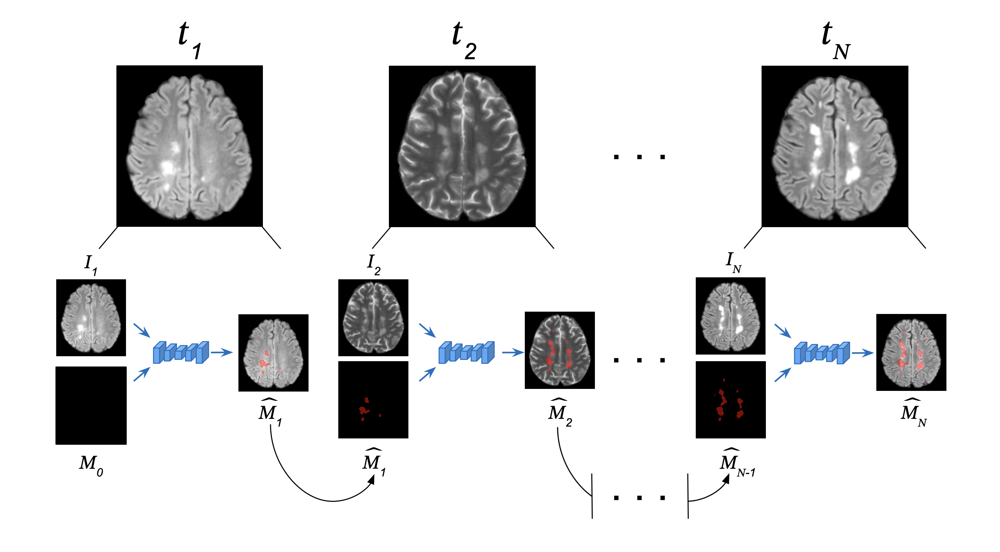
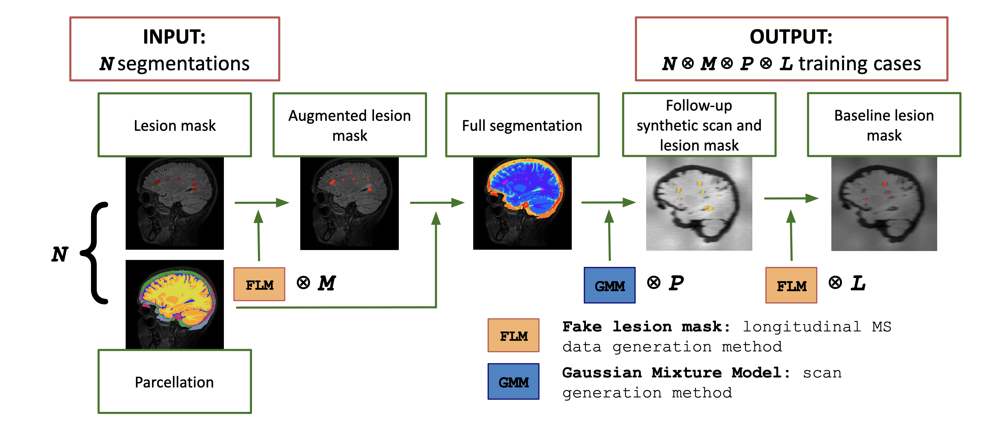

# TimeLesSeg
## Unified Contrast-Agnostic Cross-Sectional and Longitudinal MS Lesion Segmentation via a Stochastic Generative Model

This repository contains the source code from our publication currently under review, available at [arXiv](https://doi.org/10.48550/arXiv.2605.07955
). In short, our approach unifies cross-sectional (single-timepoint) and longitudinal (multi-timepoint) multiple sclerosis lesion segmentation within a single convolutional neural net. Furthermore, our approach was trained in a fully-randomized & fully-synthetic contrast-agnostic manner [(Billot et al., 2023)](https://doi.org/10.1016/j.media.2023.102789), making it capable of segmenting any MR contrast and resolution.


*The flexibility enabled by TimeLesSeg. Any number of timepoints can be segmented, regardless of modality, or absence/presence of prior information on disease state. Please note that timepoint 1 is segmented cross-sectionally – i.e., M0 is empty –, as no prior scans are available (diagnosis). The next timepoints are each segmented from the previous one's segmentation, all with the same CNN and set of weights.*

Our approach is enabled by three key contributions:
- Modelling longitudinal inputs through lesion masks instead of prior scans.
- Devising a [generative longitudinal module](https://github.com/NeuroADaS-Lab/FLM) that sinthesizes endless prior timepoints given a lesion mask.
- Integrating our longitudinal synthetic module with a previously described GMM-based scan generative approach, for a fully synthetic pipeline that synthesizes a longitudinal MS dataset from a set of less than ten segmentations.


*Generative pipeline with which TimeLesSeg was trained. Please, refer to our [arXiv record](https://doi.org/10.48550/arXiv.2605.07955) for more details.*

### Installation
#### Install required python packages
Installation should be straightforward. First, clone the present repo, `cd` into it, and run (with python >= 3.12 installed):
```bash
pip install -e .
```
The `-e` is optional, but it will let you make changes to the code without having to re-install.

#### Download models/weights

TimeLesSeg's weights are freely available on our [Zenodo record](https://zenodo.org/records/20310951). The first time you run the [inference entrypoint script](entrypoint.py), they will be automatically downloaded. If you prefer manually doing so, please remember to move the downloaded contents to [trained_models/resunet_128_128_96_20_09_25](trained_models/resunet_128_128_96_20_09_25) afterwards.

#### Docker support

We've added Dockerfiles to facilitate the usage of TimeLesSeg without requiring installing packages on your local machine. Therefore, you can use [Dockerfile](Dockerfile)/[Dockerfile-cuda](Dockerfile-cuda) (without/with cuda-enabled pytorch, respectively) to build an image with our software installed and the models inside. Please refer to [NVIDIA's user guide](https://docs.nvidia.com/datacenter/cloud-native/container-toolkit/latest/sample-workload.html#) for running gpu-enabled docker containers.

*Note: Whether it's best to pass the weights to docker when calling `container run` or storing them inside the image at build time is up for debate. If you'd rather do the former, you only have to remove the corresponding `COPY` instruction from the Dockerfile and pass them instead with `-v` as follows: `docker container run ... -v $(pwd)/trained_models:/app/trained_models ...`.*


### Usage

TimeLesSeg can process an arbitrary number of scans, provided that they belong to the same subject and all have been registered (are all in the same space). Using an optional baseline mask, one can provide the model with a prior on disease state, equating to longitudinal processing.

```bash
python3 entrypoint.py \
    -i [SCAN 1] [SCAN 2] ... [SCAN M] \
    -o [OUTPUT FOLDER] \
    -m [BASELINE MASK] (OPTIONAL) \
    -w [WEIGHT 1] [WEIGHT 2] ... [WEIGHT M] (OPTIONAL) \
    --device [DEVICE] (OPTIONAL)
```

Using "`-w`", you can control how the probabilities derived from each modality are combined. For example, given that FLAIR represents the clinical gold standard to identify MS lesions, one might desire to upweight it w.r.t. other modalities such as T1w (see examples). Their summing to 1.0 is not enforced nor checked, but it is strongly recommended that they do.

### Examples

#### Inference using TimeLesSeg

To see examples of both cross-sectional and longitudinal processing with TimeLesSeg of both timepoints from one of MSLESSEG's subjects (`P22`), please refer to their [respective files under `examples/`](examples/).

##### Cross-sectional processing

Cross-sectional segmentation is performed by not providing a baseline mask. For example, given modalities FLAIR, T1w and T2w, you can run lesion segmentation with:

```bash
python3 entrypoint.py \
    -i FLAIR.nii.gz T1w.nii.gz T2w.nii.gz \
    -o output \
    -w 0.5 0.25 0.25
```

This will give double the weight to the probabilities derived from FLAIR compared to the other two modalities. By default, we use weights equal to $1/N$, $N$ being the number of modalities. Segmentations for each modality and the weighted ensemble can then be found under folder `output`. 


##### Longitudinal processing

Now, let's say you acquired new imaging data from the previous subject, at timepoint 2. You can use our previous result as a prior to segment them. This can be done as follows:

```bash 
python3 entrypoint.py \
    -i FLAIR_TP2.nii.gz T2w_TP2.nii.gz \
    -m output/FLAIR_timelesseg_ensemble.nii.gz \
    -o output_TP2
```

#### Generating synthetic longitudinal MS data

TimeLesSeg was trained exclusively on synthetic data, generated in the same manner as in the [example file](examples/data-generation.sh), with the only difference being the number of initial segmentations and the total number of cases generated.

To run our generative pipeline, you'll need a separate python 3.8 installation. Once that has been installed, you can then install SynthSeg and all its dependencies with:

```bash
pip install -r requirements_synthseg.txt
```

Once the environment has been set up, you'll need the following segmentations as input (see [our second figure](assets/gen-pipeline.png)):
1. Brain parcellations following [NiftyWeb's Geodesic Information Flow](http://niftyweb.cs.ucl.ac.uk/program.php?p=GIF) labeling convention (Desikan-Killiany-Tourville atlas). You can obtain some ground truth parcellations by submitting a few T1w scans of your choice on their website.
2. Lesion masks (segmentations of MS lesions).

Once these requirements are met, generating sinthetic data from them can be done with the next command:

```bash
python3 -m timelesseg.data_generation.Dataset_Gen \
    --lesion_masks /path/to/lesmask1.nii.gz /path/to/lesmask2.nii.gz ... /path/to/lesmaskN.nii.gz \
    --parcellations /path/to/parcellation1.nii.gz /path/to/parcellation2.nii.gz ... /path/to/parcellationN.nii.gz \
    --output_folder /path/to/output_folder \
    --pseudo_mask_iters M \
    --synthseg_iters P \
    --fake_lesion_mask_iters L
```

This will generate $M \times P$ images and followup lesion masks, as well as $M\times P \times L$ baseline masks. The results follow the next naming convention: Images and followup masks are identified by `If_XXXX.nii.gz` and `Mf_XXXX.nii.gz`, and baseline masks as `Mb1_XXXX.nii.gz` `Mb2_XXXX.nii.gz` ... `MbL_XXXX.nii.gz` (all corresponding to case `XXXX`).

### Acknowledgements

The neural network configuration, model architecture, and training code are copied from nnUNet, a state of the art self-configuring biomedical image segmentation framework [(Isensee et al., 2021)](https://doi.org/10.1038/s41592-020-01008-z
). For data augmentation, I have also used (and extended a little bit) their batchgenerators framework (see `pyproject.toml`).

The [singleton pattern](timelesseg/singleton/) was borrowed from [Francesco Galati](https://github.com/i-vesseg/MultiVesSeg/blob/b7472b756a73d62f3163725ae7d5a5968b81766a/phase2/options/singleton.py).


### Citation

Our work has been submitted and is currently under review. In the meantime, if you find our work useful please cite our arXiv pre-print:

```
@misc{casellesballester2026timelessegunifiedcontrastagnosticcrosssectional,
      title={TimeLesSeg: Unified Contrast-Agnostic Cross-Sectional and Longitudinal MS Lesion Segmentation via a Stochastic Generative Model}, 
      author={Vicent Caselles-Ballester and Eloy Martínez-Heras and Giuseppe Pontillo and Zoe Mendelsohn and Elena M. Marrón and Juan Luis García Fernández and Laia Subirats and Jon Stutters and Jeremy Chataway and Frederik Barkhof and Sara Llufriu and Ferran Prados},
      year={2026},
      eprint={2605.07955},
      archivePrefix={arXiv},
      primaryClass={cs.CV},
      url={https://arxiv.org/abs/2605.07955}, 
}
```